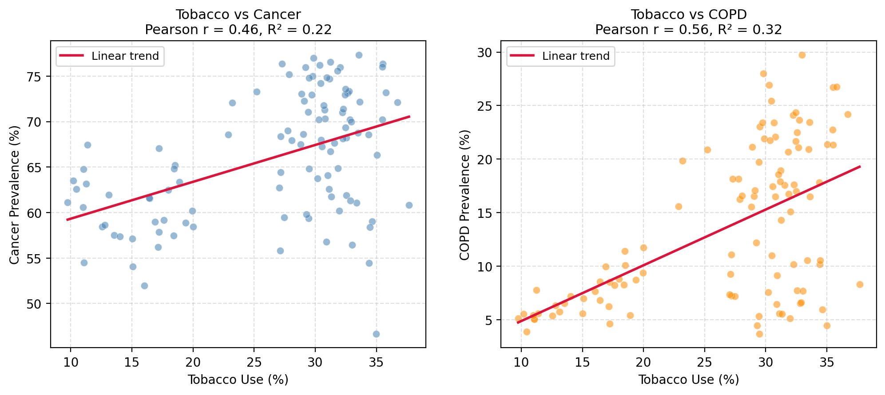

# Chronic Disease Indicators: Predicting State-Level Disease Rates from CDC Data

**DS2500: Team Project Final Report**

**Team Members:**

- Jonathan Chamberlin (chamberlin.j@northeastern.edu)
- Min Yu Huang (huang.minyu@northeastern.edu)
- Anuhya Mandava (mandava.an@northeastern.edu)
- Tsion Tekleab (tekleab.t@northeastern.edu)

**Section:** 1  
**Date:** April 21, 2026

---

## 1. Introduction

### Goal & Problem Statement

We set out to identify which health and lifestyle indicators best predict state-level rates of four major chronic disease groups: cardiovascular disease, diabetes, cancer with COPD, and mental health with alcohol use. Chronic disease rates vary dramatically across U.S. states. Mississippi's heart disease mortality is nearly double Colorado's, and diabetes prevalence ranges from under 8 percent in Colorado to over 14 percent in West Virginia. Public health campaigns often treat these conditions as individual-behavior problems, which assumes the main levers are personal. Our question was whether the data supports that assumption, or whether something else explains the state-level gaps. We focused on state as the unit of analysis because that is the level at which public health budgets are allocated and interventions are designed, and each team member took a different disease pair so we could test whether predictors matter uniformly across conditions or vary by disease.

### Why This Matters

Heart disease is the leading cause of death in the United States, and the four condition groups we studied together account for a majority of chronic-disease mortality and healthcare spending. If the strongest predictor of heart disease mortality at the state level is poverty rather than smoking, that changes which interventions state health departments should fund first. States in the Southeast carry the highest rates of most of the conditions we examined, and identifying the shared driver lets policy target the root rather than each disease separately.

---

## 2. Dataset

### Dataset Overview

- **Source:** U.S. Chronic Disease Indicators (CDI), data.cdc.gov, hosted on data.gov ([catalog.data.gov/dataset/u-s-chronic-disease-indicators](https://catalog.data.gov/dataset/u-s-chronic-disease-indicators))
- **Time Period:** 2015-2022
- **Size:** 309,216 records × 35 columns in the raw dataset. After cleaning to one value per state per indicator, the working table is 51 rows (50 states plus the District of Columbia) across 27 health indicators.
- **Format:** CSV

### Data Collection Methodology

The CDI is the CDC's official chronic-disease tracking system, aggregating values from federal sources including the Behavioral Risk Factor Surveillance System (BRFSS, a telephone survey of adults across all 50 states), the National Vital Statistics System (state-reported death certificates), and the National Health Interview Survey. Each raw row is one indicator-value-year-state observation.

### Key Variables

| Variable | Description | Type | Example |
|---|---|---|---|
| LocationDesc | State or territory name | Categorical | "Mississippi" |
| Topic | Disease or risk-factor category | Categorical | "Cardiovascular Disease" |
| Question | Specific indicator measured | Categorical | "Mortality from heart failure" |
| DataValue | Indicator value for the state-year | Numeric | 280.4 |
| DataValueType | Rate format (per 100k, age-adjusted %, etc.) | Categorical | "Age-adjusted Prevalence" |
| Stratification1 | Demographic cut (Overall, sex, race) | Categorical | "Overall" |
| YearStart | Measurement year | Numeric | 2022 |

Our predictor set for the cardiovascular model was seven indicators: adult smoking rate, obesity rate, physical inactivity, flu vaccination coverage, poverty rate, food insecurity, and high school completion rate.

### Ethical Considerations

CDI is aggregated at the state level, so no individual records are published. The bias that mattered for us is representational: BRFSS is a phone survey, so households without phones, unhoused people, and people in institutional settings are systematically underrepresented, which probably pushes our poverty-related signals downward. Insurance coverage and social support were missing for 16 of the 51 states each, so we excluded insurance from the cross-disease model rather than impute the gap. State-level analysis also carries an ecological-fallacy risk: a state-level correlation between poverty and heart disease does not imply the same proportional risk for an individual in poverty, and we flag this throughout the results.

---

## 3. Methods

### Data Preprocessing

We filtered the raw CDI CSV to six topics (Cardiovascular Disease, Diabetes, Cancer, COPD, Alcohol, Mental Health), kept rows with a numeric `DataValue` and `Stratification1 = "Overall"` to avoid subgroup contamination, and dropped columns more than 50 percent null. We then pivoted to a state-by-indicator matrix at the latest available year per indicator (mostly 2022), preserving each indicator's native rate format so that comparisons are within-indicator rather than cross-indicator.

### Exploratory Data Analysis

Early EDA surfaced two patterns that shaped the modeling. First, heart disease mortality, poverty, obesity, and physical inactivity clustered geographically in the Southeast, and the correlation heatmap showed them moving together. Second, diabetes and obesity were correlated (Pearson r = 0.464, p = 0.0004; see Figure 1) but the cluster was weaker than the heart-disease cluster, which suggested the drivers for diabetes were not identical to those for heart disease.

We also saw that stroke mortality was poorly correlated with the same risk-factor set, which became a signal to investigate.

*Figure 1. Obesity rate vs. diabetes prevalence across U.S. states (2022). Pearson r = 0.464, p = 0.0004. The Southeast cluster (MS, LA, AL, WV, AR) sits in the upper right; Colorado and Vermont anchor the lower left.*

### Modeling & Evaluation

For each disease track we built two models and compared them: a linear regression for interpretability of which predictors carry weight, and a K-nearest-neighbors regression for capturing non-linear similarity between states. We picked both because with 51 states and roughly 7 features, the two methods each have failure modes that the other does not, so agreement between them raises our confidence.

With only 51 observations, a standard 80/20 train-test split would leave about 10 states in the test set, which is not enough to evaluate. We used leave-one-out cross-validation (LOOCV) across every model so that each state is predicted using the other 50 as training data. Features were standardized before KNN so that all predictors contribute on the same scale. For KNN we swept k = 3, 5, 7, 9 and reported the best-performing k by LOOCV R².

For the cardiovascular model, the outcome variable was heart disease mortality per 100,000, and the predictors were the seven indicators listed in Section 2. The diabetes, cancer/COPD, and alcohol/mental-health tracks used a lighter modeling treatment than the cardiovascular track: diabetes was analyzed as a single-predictor LOOCV regression of diabetes prevalence on obesity rate (plus the Pearson correlation), and cancer, COPD, alcohol, and mental-health outcomes were analyzed via bivariate Pearson correlation and simple regression against the strongest available CDI predictor. We made that choice because the cardiovascular indicator set (seven well-populated predictors, one clean outcome) was the only track where a full multi-feature model was well-supported by the CDI coverage; running KNN with scarce predictors on the other tracks would have been a harder sell statistically. The trade-off is that the cross-disease comparison we draw in the Conclusions is between a full seven-feature model for heart disease and simpler bivariate evidence for the other three tracks.

---

## 4. Results & Conclusions

### Finding 1: Poverty predicts heart disease more than smoking does

Our best cardiovascular model explains 65 percent of the state-level variation in heart disease mortality (KNN, k=7, LOOCV R² = 0.65). The linear model came in at R² = 0.53, and the fact that both methods landed near the same story gave us confidence in the finding.

The single strongest predictor is poverty. Its standardized coefficient is roughly four times larger than smoking's in the full seven-feature model (see Figure 2). States above the median poverty rate have significantly higher heart disease mortality than states below it (p < 0.0001). This is the result we did not expect. Public health messaging around heart disease is built around individual lifestyle, but at the state level, the economic environment carries more weight than smoking does.

To test whether that gap survives when we strip out the correlated predictors, we ran a two-feature partial model with only poverty and smoking. Poverty's standardized coefficient drops from its seven-feature value to 0.54, smoking's rises to 0.34, and the model still explains 63 percent of state-level heart disease mortality (R² = 0.628). Poverty is now about 1.6x smoking rather than 4x, but it still dominates. The bigger gap in the full seven-feature model is partly shared variance between poverty and food insecurity (pairwise r = 0.83) getting allocated to poverty; the partial regression is the more honest comparison.

*Figure 2. Standardized regression coefficients for the seven-feature linear model predicting state-level heart disease mortality (n = 51 states). Poverty is the largest coefficient (β = 13.45), roughly 4× smoking's (β = 3.17). Obesity, food insecurity, and HS completion fall in between.*

### Finding 2: Diabetes is obesity-driven, not poverty-driven

Diabetes behaves differently from heart disease. Obesity is the dominant predictor of diabetes prevalence, and poverty's effect shrinks sharply. Across states, obesity and diabetes prevalence correlate at r = 0.464 (p = 0.0004), and obesity alone explains 17 percent of the state-level variation in diabetes (LOOCV R²; see Figure 1). The top of the predictor ranking is different from heart disease, which is the cleanest evidence we have that the same CDC data points to different drivers for different diseases.

Geographically, the highest diabetes prevalence concentrates in the Southeast (West Virginia, Mississippi, Louisiana, Alabama, Arkansas), while the lowest sits in Colorado, Vermont, and Montana. The same southeastern band shows up in the heart disease and poverty choropleths (Figure 3), which is what tipped us off that poverty was the shared driver and obesity was the diabetes-specific driver.

*Figure 3. State-level choropleth of heart disease mortality, 2022. The same Southeast band (MS, LA, AL, WV, AR) appears in the diabetes and poverty choropleths we built but do not reproduce here for space.*

### Finding 3: Tobacco use correlates with cancer and COPD, but explains less than expected

For cancer and COPD we expected tobacco use to dominate. It correlates with both (r = 0.46 for cancer, r = 0.57 for COPD; see Figure 4) and both correlations are highly significant (p < 0.0001), but tobacco alone explains only 22 percent of variation in cancer prevalence and 32 percent in COPD prevalence. That leaves roughly two-thirds to three-quarters of the between-state variation unaccounted for by tobacco use. The implication is that even for diseases with a well-known single-factor story, state-level outcomes are shaped by a wider set of inputs (air quality, occupational exposure, healthcare access, screening rates) that our current model does not capture.

*Figure 4. Tobacco use vs. cancer prevalence (left, r = 0.46, R² = 0.22) and tobacco use vs. COPD prevalence (right, r = 0.57, R² = 0.32) across U.S. states pooled across 2019–2022, with linear trend lines.*

### Finding 4: Alcohol and mental-health outcomes track specific social indicators

For alcohol, per-capita alcohol consumption among people aged 14 and older was the strongest predictor of alcoholism outcomes (p = 0.0002). For mental health, the strongest predictor we found among the available indicators was postpartum depressive symptoms among women with a recent live birth (p = 0.0118). Both predictors are social indicators rather than clinical ones, which echoes the pattern from the heart-disease result. When you measure upstream social and demographic conditions, they correlate with downstream health outcomes at levels comparable to or greater than traditional clinical risk factors.

*Figure 5. Normalized rates of alcohol indicators (top) and mental-health indicators (bottom) for the United States, 2020. Indicators are normalized to a common 0–1 scale (percent indicators by 100, per-capita alcohol consumption by 5 gallons). Per-capita alcohol consumption is the dominant alcohol indicator; depression among adults is the largest mental-health indicator, with postpartum depressive symptoms among the strongest predictors of state-level mental-health outcomes.*

### Conclusions

Going back to our original question: at the state level, the same CDC dataset points to different drivers for different chronic diseases. Heart disease is dominated by poverty, diabetes by obesity, cancer and COPD by a mix where tobacco is significant but far from sufficient, and alcohol and mental-health outcomes by specific upstream social indicators. A public health strategy built around "target individual behavior" fits diabetes reasonably well, fits cancer and COPD partially, and fits heart disease poorly. The Southeast appears at the top of almost every outcome we studied, and the shared factor that shows up in the heart-disease and diabetes rankings is poverty.

The policy implication is that state-level interventions that only target behavior miss the part of the variance tied to economic and social conditions. We are not claiming individual behavior is irrelevant. Smoking still correlates with cancer and COPD, and obesity still correlates with diabetes. But at the state level, the social and economic predictors carry more weight than the public-health messaging suggests.

---

## 5. Future Work & Limitations

### Limitations

With 51 observations the dataset is small. LOOCV gives us every state as a test point, but it does not buy us statistical power. We report standardized coefficients and p-values but did not compute bootstrap confidence intervals on the coefficients themselves, so the 4x gap between poverty and smoking should be read as a ranking, not a point estimate with a precise margin.

Predictor collinearity is a second caveat on that ranking. Poverty covaries with food insecurity (r = 0.83), smoking (r = 0.64), and obesity (r = 0.58) across states. Variance inflation factors for the seven-feature model put poverty at 5.13 (the highest of the set), food insecurity at 3.50, and obesity at 3.36, which means the 4x gap between poverty and smoking in the full model is partly shared variance getting allocated to poverty rather than a clean independent effect. The two-feature partial regression we report under Finding 1 is the more defensible comparison, and in that model poverty is still larger than smoking but by a 1.6x margin rather than 4x.

Our analysis is ecological. A state-level correlation between poverty and heart disease does not establish that an individual in poverty carries a proportional personal risk, and the ecological fallacy would wrongly read the state-level result as an individual-level claim. Missing data also shaped the analysis: insurance coverage and social support were missing for 16 states each, so we excluded them from the cross-disease model, which means we cannot directly compare the effect of insurance against poverty even though the two are connected.

The predictor set is limited to what CDI publishes at the state level. Important drivers we suspect matter (air quality, occupational exposure, healthcare density, urban-rural mix) are either absent or measured only at the county level. Cancer and COPD are the clearest example: tobacco explains roughly a quarter of the variance, so a better-specified model would pull in variables we did not have. Our values also come mostly from 2022, so the findings describe the 2022 snapshot more reliably than 2015 or any future year.

### Future Research Directions

Four extensions would strengthen the next iteration.

1. **County-level data.** The CDI publishes some indicators at county granularity. Moving from n = 51 to n > 3,000 counties would give us real statistical power and let us control for within-state variation.

2. **Broader predictor set.** Healthcare access (provider density, insurance with imputation), environmental exposure (air quality, proximity to industrial sites), and demographic structure (age pyramid, rural-urban mix) were all absent from our current set.

3. **Stroke as a control case.** Stroke mortality is poorly predicted by the seven-feature linear model (R² = 0.11), and KNN only reaches R² = 0.27. Running the full feature comparison on stroke would tell us whether the poverty finding is specific to heart disease or generalizes across cardiovascular outcomes.

4. **Policy deliverable.** If the goal is to let state health departments target interventions, the right output is not a regression model but a ranked list of states by controllable risk factor, with confidence intervals, which would turn the academic result into something a public health office could act on.

---

## References

Centers for Disease Control and Prevention. (2024). *U.S. Chronic Disease Indicators*. Data.CDC.gov. https://catalog.data.gov/dataset/u-s-chronic-disease-indicators

Centers for Disease Control and Prevention. (2024). *Behavioral Risk Factor Surveillance System Overview*. https://www.cdc.gov/brfss/about/index.htm

Hastie, T., Tibshirani, R., & Friedman, J. (2009). *The Elements of Statistical Learning* (2nd ed.). Springer.

Pedregosa, F., Varoquaux, G., Gramfort, A., et al. (2011). Scikit-learn: Machine learning in Python. *Journal of Machine Learning Research, 12*, 2825-2830.
